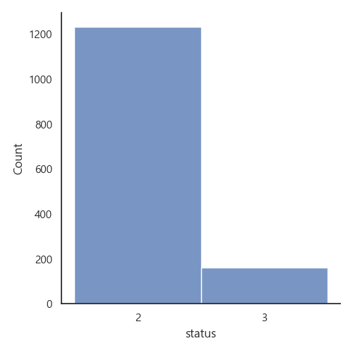
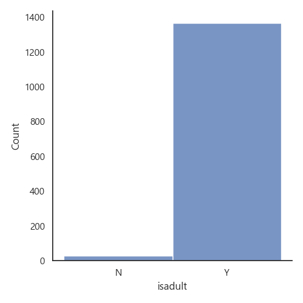
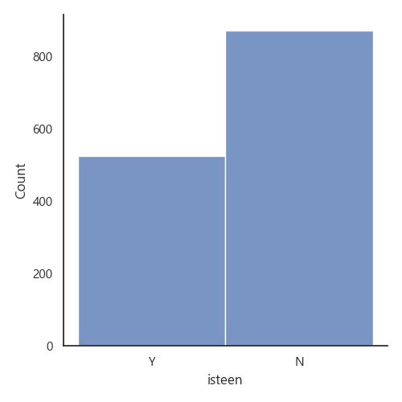
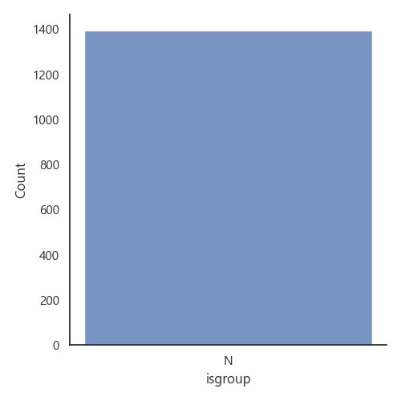
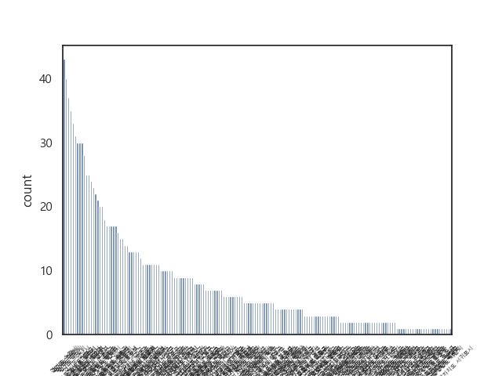
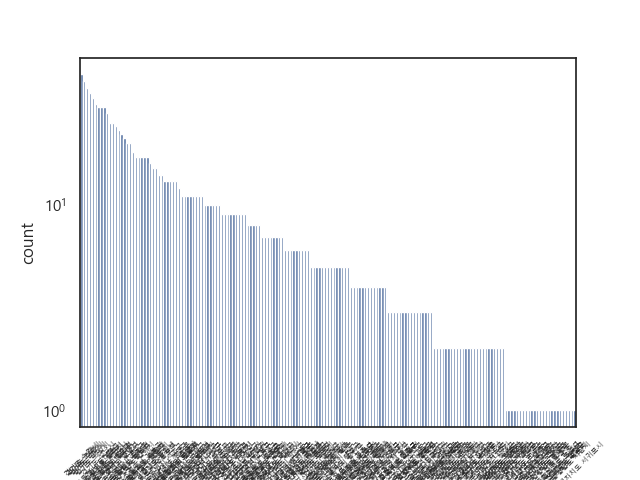
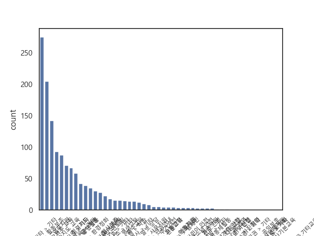

# API 샘플 데이터 수집 및 EDA


24년 8월 1일부터 31일까지의 1395건의 데이터를 대상으로 합니다.

[샘플 데이터는 csv 파일로 확인할 수 있습니다.](https://github.com/kakao-tech-campus-2nd-step3/Team20_BE/blob/data/data/1365_data_240801to31.csv)

데이터는 다음과 같은 정보를 포함합니다.

```python
            'program_no': item.findtext('progrmRegistNo'),
            'title': item.findtext('progrmSj'),
            'status' : item.findtext('progrmSttusSe'),
            'notice_start_date': item.findtext('progrmBgnde'),
            'notice_end_date': item.findtext('noticeBgnde'),
            'act_start_date' : item.findtext('progrmBgnde'),
            'act_end_date' : item.findtext('noticeEndde'),
            'act_start_time': item.findtext('actBeginTm'),
            'act_end_time': item.findtext('actEndTm'),
            'location': item.findtext('actPlace'),
            'contact': item.findtext('telno'),
            'description': item.findtext('progrmCn'),
            'recruit' : item.findtext('rcritNmpr'),
            'weekday' : item.findtext('actWkdy'),
            'category' : item.findtext('srvcClCode'),
            'isadult' : item.findtext('adultPosblAt'),
            'isteen' : item.findtext('yngbgsPosblAt'),
            'isgroup' : item.findtext('grpPosblAt'),
            'host_place' : item.findtext('mnnstNm'),
            'regist_place' : item.findtext('nanmmbyNm'),
            'si_code' : item.findtext('gugunCd'),
            'manager_adress' : item.findtext('postAdres')
```

## 수집 과정
행정안전부 봉사활동참여정보 API와 카카오 로컬 API를 활용합니다.
다음과 같은 4개의 함수로 API를 받아옵니다.

``` Python
# 기간에 따라 봉사활동 참여 정보 목록을 불러오는 함수입니다.
def get_volunteer_participation_list(start_date, end_date, num_of_rows=10, page_no=1, sido_code=None, gugun_code=None):

# 봉사 활동 상세 정보를 불러오는 함수입니다.
def get_volunteer_detail(program_no):

# 키워드로 검색하여 좌표값을 획득하는 함수입니다. 검색되지 않은 경우 다음 함수를 호출합니다.
def get_coordinates_by_keyword(address):

# 주소로 검색하여 좌표값을 획득하는 함수입니다.
def get_coordinates_by_adress(address):
```


## EDA

### 각 열의 Null 값
```
program_no             0
title                  0
status                 0
notice_start_date      0
notice_end_date        0
act_start_date         0
act_end_date           0
act_start_time         0
act_end_time           0
location               0
contact                0
description            0
recruit                0
weekday                3
category               0
isadult                0
isteen                 0
isgroup                0
host_place             0
regist_place           0
si_code                0
manager_adress         0
pruned_adress          0
coordinates          477
dtype: int64
```

### 모집 상태


3은 모집 완료, 2는 모집 중, 1은 모집 대기 중(해당 없음)


### 모집 대상




성인 모집, 단체 모집 가능 여부는 유의미하지 않은 것으로 생각됨.

### 활동 지역



활동 지역 예) 경기도 수원시, 서울특별자치시 노원구

값이 나타난 활동 지역은 173개였음. 이에 대한 분포는 로그 스케일로 나타남. 구체적인 동으로 나누는 것은 데이터 갯수 측면에서 유의미하지 않을 것으로 생각됨.

### 활동 카테고리



값이 나타난 활동 카테고리는 50개였음, 분류되지 않음에 해당하는 기타 > 기타가 가장 많았으며, 생활편의 분야와 교육이 그 뒤를 이었음. 대분야로 묶는 것은 유의미하지 않을 것이라 생각됨.

구체적인 카테고리는 다음과 같음

```
category
생활편의지원 > 활동보조             275
기타 > 기타                   205
행정보조 > 업무지원               142
교육 > 방과후 교육                93
교육 > 학습지도 교육               88
생활편의지원 > 청결지도              71
생활편의지원 > 기타                67
생활편의지원 > 급식지원              59
문화행사 > 공연활동                42
교육 > 기타                    39
환경보호 > 환경정화                35
생활편의지원 > 식사.반찬지원           31
문화행사 > 행사보조                28
보건의료 > 기타                  23
멘토링 > 멘토링                  18
환경보호 > 기타                  16
행정보조 > 기타                  16
교육 > 평생교육                  15
교육 > 특수교육                  14
멘토링 > 학습                   14
문화행사 > 기타                  13
상담 > 말벗.상담                 10
행정보조 > 사무지원                 9
문화행사 > 관광안내                 6
주거환경 > 주거개선                 6
안전.예방 > 교통안전                5
교육 > 전문교육                   5
생활편의지원 > 이동지원               5
보건의료 > 의료지원                 4
문화행사 > 캠페인                  4
안전.예방 > 어린이 안전              4
안전.예방 > 청소년 안전              4
농어촌 봉사 > 일손지원               3
보건의료 > 간호.간병                3
주거환경 > 마을공동체활동              3
안전.예방 > 기타                  3
안전.예방 > 취약계층 안전             2
국제협력.해외봉사 > 통.번역            2
상담 > 전문상담                   2
안전.예방 > 지역안전                1
보건의료 > 헌혈                   1
문화행사 > 사진촬영                 1
주거환경 > 기타                   1
국제협력.해외봉사 > 국제행사단체지원        1
공익.인권 > 기타                  1
공익.인권 > 공익보호                1
자원봉사교육 > 자원봉사기본교육           1
멘토링 > 진로적성                  1
멘토링 > 기타                    1
자원봉사교육 > 자원봉사기타교육.기타교육      1
Name: count, dtype: int64
```

## 